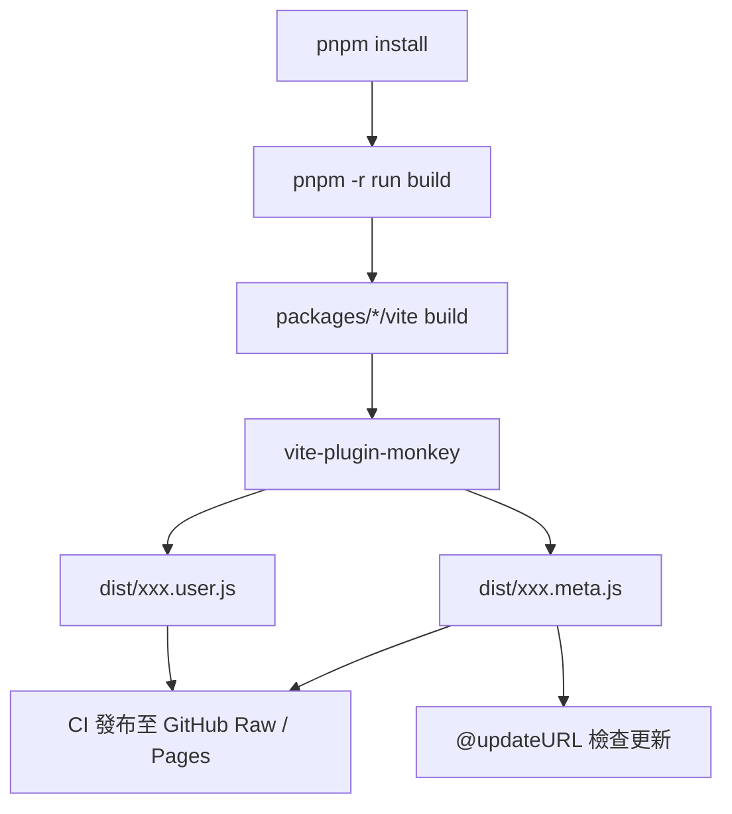
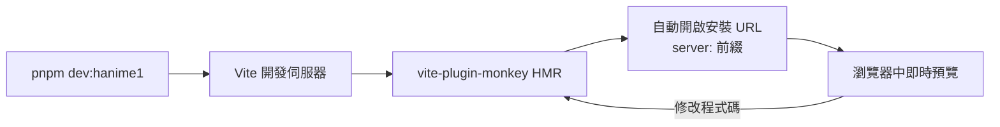

# Monorepo 架構規劃

> 多個 UserScripts 的統一開發倉庫。基於 **bun workspaces** + **vite-plugin-monkey**，每個腳本一個獨立套件，共享工具與型別透過 `@userscripts/shared` 統一管理。

## 技術選型理由

| 決策       | 選擇                          | 理由                                                             |
| ---------- | ----------------------------- | ---------------------------------------------------------------- |
| 套件管理器 | bun workspaces                | 單一高效二進位，無 node_modules 相容性問題；原生 TypeScript 支援 |
| 建置工具   | Vite + vite-plugin-monkey     | 官方支援 HMR 自動安裝、ESM 導入 GM_api、TypeScript 全程支援      |
| 框架偏好   | Vanilla TS > SolidJS > Svelte | 依腳本性質決定（見下節）                                         |
| 語言       | TypeScript                    | 跨腳本共用型別；`@userscripts/shared` 提供統一介面               |
| CI         | GitHub Actions                | 由 `<id>-v<version>` tag 觸發，自動建置並發布 Release            |

## 框架選擇決策矩陣

| 腳類性質                                            | 推薦框架       | 範例                                                 |
| --------------------------------------------------- | -------------- | ---------------------------------------------------- |
| DOM 手術型：改寫既有按鈕、監聽頁面事件、注入少量 UI | **Vanilla TS** | `hanime1-download-manager`（大量沿用網站原生 class） |
| 完整應用型：浮層面板、設定頁、狀態管理複雜的互動 UI | **SolidJS**    | 需要響應式狀態與元件化的工具面板                     |
| 內容聚合型：提取頁面資料做展示層渲染                | **Svelte**     | 資訊聚合與重排版                                     |

> 注意：使用者腳本注入在頁面上下文中執行，框架會增加體積。vanilla 腳本 gzip 後通常 < 10KB；SolidJS（無虛擬 DOM）與 Svelte（編譯期優化）是框架首選。

## 目錄結構

```text
UserScripts/
├── .github/
│   └── workflows/
│       └── release.yml            # CI：tag 觸發建置並發布 Release
├── docs/                          # 專案文檔
│   ├── vite-plugin-monkey.md
│   ├── violentmonkey.md
│   └── monorepo-architecture.md   # 本文件
├── packages/
│   ├── shared/                    # 共用工具與型別
│   │   ├── src/
│   │   │   ├── i18n.ts            # i18n 工具（多語言選單）
│   │   │   ├── theme.ts           # 主題探測工具
│   │   │   ├── gm.ts              # GM_api 封裝（依賴注入）
│   │   │   ├── gm-types.ts        # GM 型別宣告
│   │   │   ├── types.ts           # 共用型別
│   │   │   └── index.ts
│   │   ├── package.json           # name: @userscripts/shared
│   │   └── tsconfig.json
│   └── hanime1-download-manager/  # 腳本套件（userscript.id: h1dl）
│       ├── src/
│       │   ├── main.ts            # 入口：vite-plugin-monkey entry
│       │   ├── api.ts             # 品質查詢與 videoId 解析
│       │   ├── i18n.ts            # 語言字串
│       │   ├── batch.ts           # 批量下載與進度條
│       │   ├── download.ts        # 按鈕狀態機與單一下載
│       │   ├── menu.ts            # 畫質選單
│       │   ├── inject.ts          # 頁面注入（watch / listing）
│       │   └── styles.ts          # 樣式注入
│       ├── dist/                  # 建置產出（.user.js / .meta.js）
│       ├── vite.config.ts         # 元數據 + updateURL/downloadURL
│       ├── package.json           # userscript.id
│       ├── tsconfig.json
│       └── vite-env.d.ts
├── scripts/                       # 倉庫腳本
│   └── new-script.mjs             # 腳手架：建立新腳本套件
├── package.json                   # 根套件：workspaces + 指令
├── bun.lock                       # bun 鎖檔
├── tsconfig.base.json             # 共用 TS 設定
└── README.md
```

## 工作區配置

```jsonc
// 根 package.json
{
  "name": "userscripts",
  "private": true,
  "version": "1.0.0",
  "type": "module",
  "scripts": {
    "dev": "bun run --filter '*' dev",
    "dev:hanime1": "bun run --filter '@userscripts/hanime1-download-manager' dev",
    "build": "bun run --filter '*' build",
    "build:hanime1": "bun run --filter '@userscripts/hanime1-download-manager' build",
    "typecheck": "bun run --filter '*' typecheck",
    "new-script": "bun run scripts/new-script.mjs",
  },
  "workspaces": ["packages/*"],
  "devDependencies": {
    "typescript": "^5.9.0",
    "vite": "^7.1.0",
    "vite-plugin-monkey": "^5.0.0",
  },
  "engines": { "bun": ">=1.2.0" },
}
```

> 注意：bun workspaces 不使用 `workspace:` 協議；本地依賴直接用 `"*"` 版本範圍，bun 會自動解析為 workspace 套件。

## 套件間依賴

```jsonc
// packages/hanime1-download-manager/package.json
{
  "name": "@userscripts/hanime1-download-manager",
  "version": "1.1.0",
  "private": true,
  "type": "module",
  "scripts": {
    "dev": "vite",
    "build": "vite build",
    "typecheck": "tsc --noEmit",
  },
  "dependencies": {
    "@userscripts/shared": "*",
  },
  "devDependencies": {
    "typescript": "^5.9.0",
    "vite": "^7.1.0",
    "vite-plugin-monkey": "^5.0.0",
  },
}
```

```jsonc
// packages/shared/package.json
{
  "name": "@userscripts/shared",
  "version": "1.0.0",
  "private": true,
  "type": "module",
  "main": "./src/index.ts",
  "types": "./src/index.ts",
  "exports": {
    ".": "./src/index.ts",
    "./i18n": "./src/i18n.ts",
    "./theme": "./src/theme.ts",
    "./gm": "./src/gm.ts",
  },
}
```

## 唯一 id 與發布

版本號與腳本 id 皆由 **tag 統一管理**，`vite.config.ts` 是唯一真實來源（single source of truth）：

- **id** — `vite.config.ts` 匯出的 `USERSCRIPT_ID` 常數（小寫字母、數字與連字號，需符合 `[a-z0-9]+`）
- **版本** — 工作流從 tag 解析版本，以 `USERSCRIPT_VERSION` 環境變數注入建置；`vite.config.ts` 優先讀取該變數，回退為 `0.0.0-dev`（本機建置一律產生有效的 `@version`）
- **package.json 不含 `version` 或 `userscript.id`** — 避免多處管理不同步

> 注意：Git ref 名稱不可包含 `:`，因此 tag 格式為 `<id>-v<version>`（如 `h1dl-v1.1.0`）。

| 套件                                    | USERSCRIPT_ID | 發布 tag 範例 |
| --------------------------------------- | ------------- | ------------- |
| `@userscripts/hanime1-download-manager` | `h1dl`        | `h1dl-v1.1.0` |

推送 tag 後 `.github/workflows/release.yml` 會：

1. 解析 tag（正則 `^([a-z0-9][a-z0-9-]*)-v([0-9].*)$`，在最後一個 `-v` 處分割）→ 找到 `USERSCRIPT_ID` 匹配的 `vite.config.ts` 所在套件；找不到則跳過
2. 以 `USERSCRIPT_VERSION`=<版本> 環境變數執行 `bun install --frozen-lockfile` → `typecheck` → `build`
3. 將 `dist/*.user.js` 與 `dist/*.meta.js` 作為 GitHub Release 附件發布
4. 將成品強制推送（force-add）至 `main` 分支的 `dist/` — `@updateURL`／`@downloadURL` 指向 raw.githubusercontent.com，檔案必須存在於 `main` 才能解析，否則已安裝的腳本每次檢查更新都會 404

```ts
// vite.config.ts — id 與版本的唯一定義處
export const USERSCRIPT_ID = "h1dl";
const VERSION = process.env.USERSCRIPT_VERSION ?? pkg.version ?? "0.0.0-dev";
```

`vite.config.ts` 會自動注入 `@author`、`@updateURL`（指向 `.meta.js`）與 `@downloadURL`，安裝後的腳本可由腳本管理器自動更新。

## 共享工具：@userscripts/shared

從 `hanime1-download-manager.user.js` 抽取可重用邏輯：

```typescript
// packages/shared/src/i18n.ts
import { GM_getValue, GM_setValue, GM_registerMenuCommand } from "$";

export type LangCode = "zh-TW" | "zh-CN" | "en";

/**
 * 建立多語言選單：每個語言註冊一個 GM_registerMenuCommand，
 * 當前語言標記 ✓，切換後儲存並重載頁面。
 */
export function createI18nMenu<TLang extends string>(options: {
  langs: TLang[];
  defaultLang: TLang;
  langNames: Record<TLang, string>;
  storageKey: string;
}): { lang: TLang; t: (key: string) => string } {
  const { langs, defaultLang, langNames, storageKey } = options;
  const saved = GM_getValue(storageKey, null) as TLang | null;
  const lang = langs.includes(saved) ? (saved as TLang) : defaultLang;

  if (typeof GM_registerMenuCommand === "function") {
    for (const code of langs) {
      GM_registerMenuCommand(langNames[code] + (code === lang ? " ✓" : ""), () => {
        if (code === lang) return;
        GM_setValue(storageKey, code);
        location.reload();
      });
    }
  }

  return { lang, t: (key) => key };
}
```

```typescript
// packages/shared/src/gm.ts
import { GM_xmlhttpRequest } from "$";

/** Promise 化的 GM_xmlhttpRequest */
export function gmFetch(url: string): Promise<string> {
  return new Promise((resolve, reject) => {
    GM_xmlhttpRequest({
      method: "GET",
      url,
      onload: (res) => resolve(res.responseText),
      onerror: (err) => reject(err),
    });
  });
}
```

```typescript
// packages/shared/src/theme.ts
/**
 * 探測網站原生 CSS 主題，避免硬編碼顏色。
 * 讀取 .offsetLeft 強制同步 reflow，取得真實 computed style。
 */
export function probeTheme(probeClass: string): CSSStyleDeclaration {
  const probe = document.createElement("div");
  probe.className = probeClass;
  probe.style.cssText =
    "position:fixed;left:-9999px;top:-9999px;visibility:hidden;z-index:-1;display:block!important;opacity:1";
  document.body.appendChild(probe);
  probe.offsetLeft; // 強制 reflow
  const style = getComputedStyle(probe);
  probe.remove();
  return style;
}
```

## 建置流程



## 開發流程



## 新增腳本流程

1. 執行 `pnpm new-script <name>`（腳手架腳本）
2. 選擇框架：Vanilla / SolidJS / Svelte
3. 腳手架建立 `packages/<name>/`：`package.json`、`vite.config.ts`、`src/main.ts`、`tsconfig.json`、`vite-env.d.ts`
4. 在 `vite.config.ts` 的 `userscript` 區塊填寫 `@match`、`@grant`、`@connect` 等元數據
5. 執行 `pnpm install`（更新 workspace 連結）後 `pnpm dev:<name>`

## CI/CD 規劃

```yaml
# .github/workflows/build.yml（規劃）
name: Build Userscripts
on:
  push:
    branches: [main]
  pull_request:

jobs:
  build:
    runs-on: ubuntu-latest
    steps:
      - uses: actions/checkout@v4
      - uses: pnpm/action-setup@v4
      - uses: actions/setup-node@v4
        with:
          node-version: 20
          cache: pnpm
      - run: pnpm install --frozen-lockfile
      - run: pnpm typecheck
      - run: pnpm build
      - uses: peaceiris/actions-gh-pages@v4
        with:
          github_token: ${{ secrets.GITHUB_TOKEN }}
          publish_dir: packages/*/dist
```

發布後即可透過 `https://raw.githubusercontent.com/<user>/UserScripts/gh-pages/<name>.user.js` 安裝。

## 遷移計畫：hanime1-download-manager

| 階段           | 動作                                                                |
| -------------- | ------------------------------------------------------------------- |
| 1. 骨架建立    | 建立 `pnpm-workspace.yaml`、根 `package.json`、`tsconfig.base.json` |
| 2. shared 套件 | 建立 `@userscripts/shared`，抽取 i18n / gm / theme 工具             |
| 3. 腳本套件    | 建立 `packages/hanime1-download-manager/`，移植原始 1069 行腳本     |
| 4. 型別化      | 將 JS IIFE 重構為 TS 模組；`$` alias 取代全域 GM 函數               |
| 5. 驗證        | `pnpm typecheck` 與 `pnpm build:hanime1` 產出與原始腳本行為一致     |

> 注意：遷移需保持行為完全一致——`@run-at document-idle`、5 個 `@grant`、4 個 `@match` 與 5 個 `@connect` 全數保留於 `vite.config.ts` 的 `userscript` 區塊。

## 參考

- vite-plugin-monkey 文檔：[docs/vite-plugin-monkey.md](vite-plugin-monkey.md)
- Violentmonkey 文檔：[docs/violentmonkey.md](violentmonkey.md)
